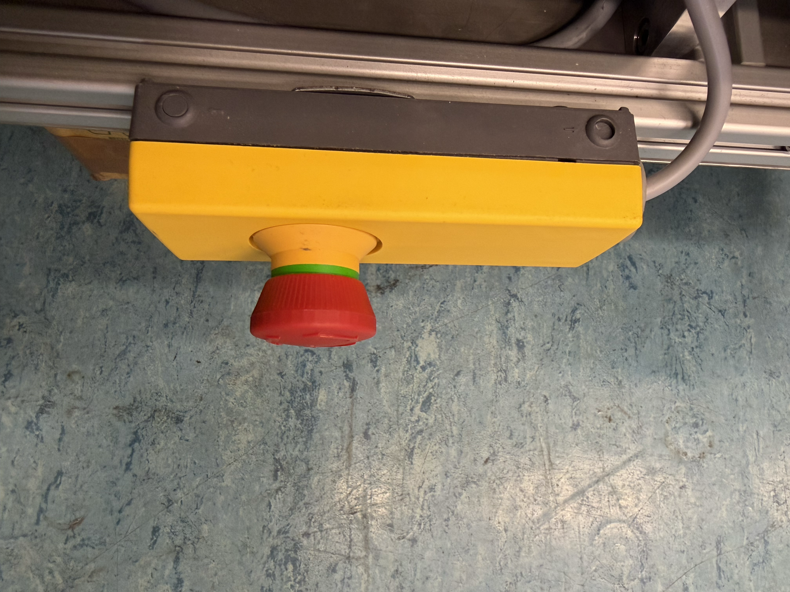
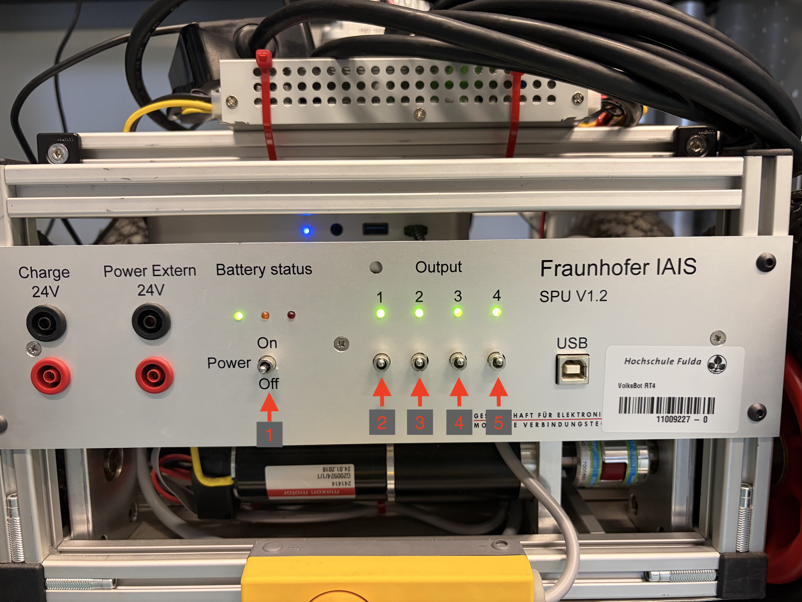
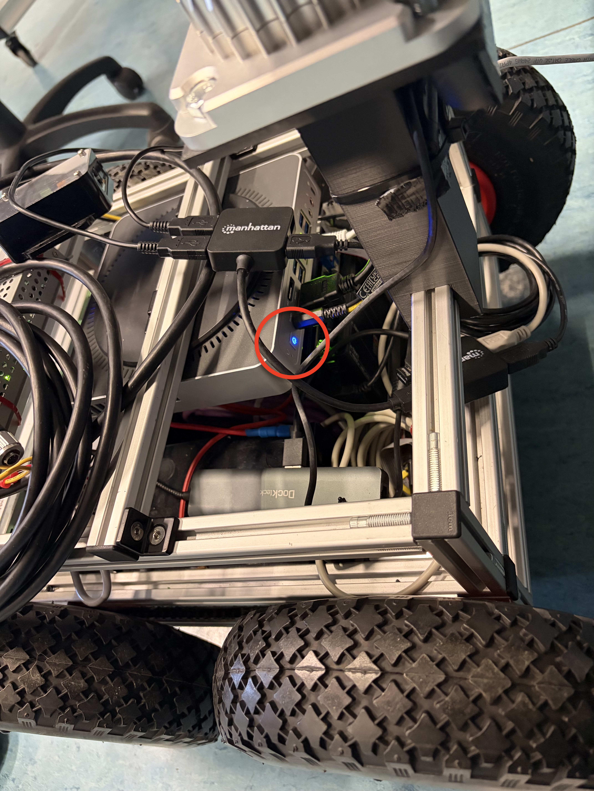

# Volksbot Driver
The volksbot driver works like a bringup package for the Volksbot. It can either be used in a 
simulated environment with Gazebo (IGN) (check [hsfd_gazebo_simulation](https://git-ce.rwth-aachen.de/roblab/hsfd_gazebo_simulation) for further information).
---
## Starting the physical robot
To start the robot follow theses steps:
1. You need to pull out the emergency button, so the green is visible:



2. Pull the switches up, starting from left (1 = main switch) to the right (2 = PC, 3 = ?, 4 = ?, 5 = ?):



3. Press PC power button:



## Turn off the physical robot
To turn it off, basically do the "Starting the phyiscal robot" reverse.
> [!Note] Main switch needs to be pushed down for 5 seconds.
---
## Prerequisites
### EPOS2 Motor Controller
This package is needed to properly use the built-in EPOS2 Motor Controller (Hardware) inside the Volksbot.
1. Navigate into the source directory of your ros2 workspace and clone the [repo](https://github.com/uos/epos2_motor_controller.git) of the EPOS2 Motor Controller:
```bash
cd ~/ros2_ws/src
git clone https://github.com/uos/epos2_motor_controller.git
```
2. It could be possible, that additional steps may be required for setting up the environment. For these follow the instructions on the [epos2_motor_controller](https://github.com/uos/epos2_motor_controller) repo.
---
### Ouster Ros Package
If the Ouster Lidar should be used, then it is also necessary to get the Ouster Ros Package.
1. Navigate into the source directory of your ros2 workspace and clone the [repo](https://github.com/ouster-lidar/ouster-ros.git) of the Ouster Ros Package:
```bash
cd ~/ros2_ws/src
git clone https://github.com/ouster-lidar/ouster-ros.git
```
2. Switch to ros2 branch.
3. Follow the instructions on the [ouster-ros](https://github.com/ouster-lidar/ouster-ros.git) repo. Get the git submodules!

---
## Getting Started
### Volksbot Driver
Make sure, that all the prerequisites were done.
1. Navigate into the source directory of your ros2 workspace and clone the [repo](https://git-ce.rwth-aachen.de/roblab/volksbot_driver.git) of the Volksbot Driver:
```bash
cd ~/ros2_ws/src
git clone git@git-ce.rwth-aachen.de:roblab/volksbot_driver.git
```
> [!Important] Important
> You need to use ssh to clone gitlab repos.
2. Source the ROS2 (Humble) environment:
```bash
source /opt/ros/humble/setup.bash
```
3. Build your workspace using colcon and source the workspace, if build was successful:
```bash
cd ~/ros2_ws
colcon build
source install/setup.bash
```
- 4 a) Launch the Volksbot Driver with keyboard controls:
```bash
ros2 launch volksbot_driver volksbot.py
```
- 4 b) Launch the Volksbot Driver with joystick controls:
```bash
ros2 launch volksbot_driver volksbot_joy.py
```